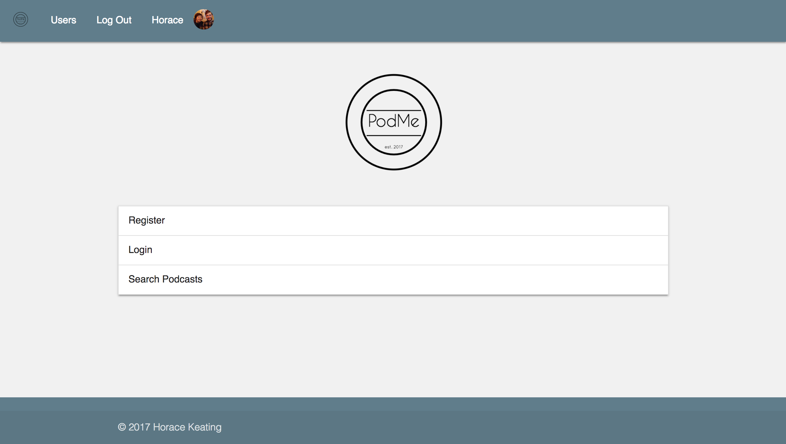
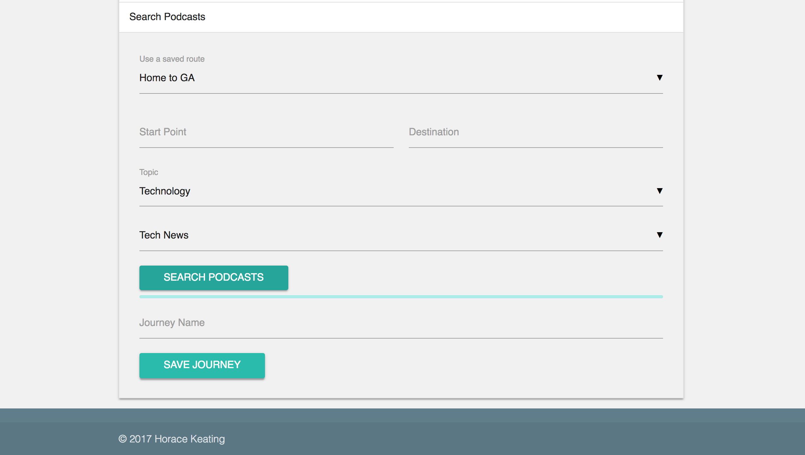
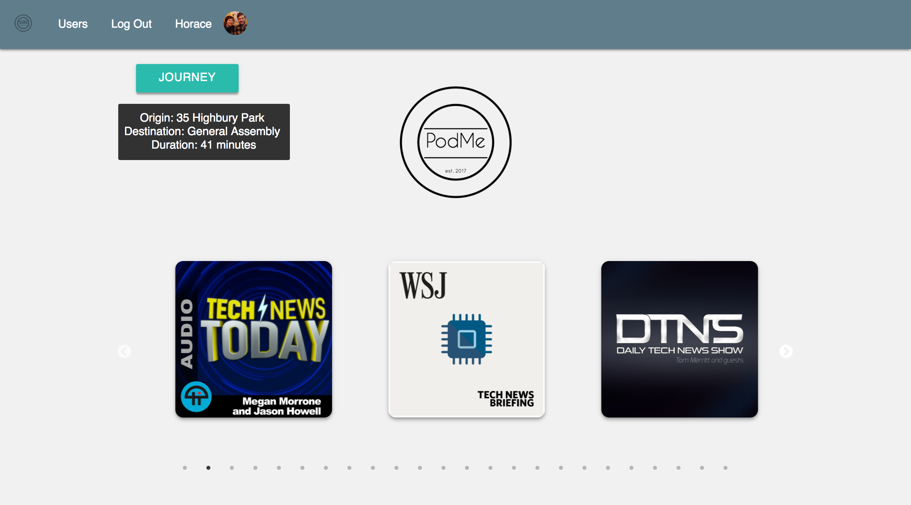

# wdi-project-2

---

## PodMe



This is my second project completed for the WDI26 course at General Assembly in London. The project brief was to build a **full-stack RESTful application** that includes **authentication**, using **Express** and **Mongo**.

## How the project came about and how it works

I love podcasts. I love listening to them, and I even tried making one with a friend for a while. I listen to them when I'm going to bed, I listen to them when I go for a run, but most of all I listen to them when I'm on the tube. The problem with that - I always end up with little bits and pieces of episodes that I didn't have time for while I was travelling, or I finish my episode only halfway to my destination: the podcast length never matched the journey.

This gave me the idea for PodMe - a web app that finds episodes of popular podcasts and matches them to your journey by duration. The user can register, log in and search podcasts all from the homepage.



After logging in, the search function is enabled: the user enters a start point and a destination (or chooses a pre-saved journey combination), then selects a topic (and subtopic if they wish) and clicks search. PodMe will then find the top podcasts in that genre and for each podcast return the 10 episodes that most closely match the duration of your journey (calculated by Google Maps)... Happy listening!



## Further features to add with more time

As this project represents just a week's work I was not able to implement all of the features that I would have liked to given more time.

Top of my list of additions would be an embedded Google Map that could be used to select start and end points for the user's journey. Alongside that, in order to further improve the flexibility of the search engine I would allow users to save specific locations rather than just the origin/destination combinations that are currently available. A further feature along these lines would be the reimplementation of a classic search box for selecting podcast topics - this was in my original MVP build of the app, but led to too many null responses from the iTunes search API (additionally part of the fun I had with this project was discovering new podcasts that I never would have found otherwise: Read 'n Code - a Podcast about literature and coding being a prime example. Who doesn't want to listen to 25 minutes on "Camus' The Plague and Reddit"..?).


Outside of the search functionality, I would like to refine the styling and develop the user account pages. Having a publicly viewable profile and ability to share/save specific podcasts (or even journey-podcast combinations) would be a first step towards this.

## How it works - the code


### Challenges faced

This project was tough, I spent a significant chunk of the week wrestling with the highly variable formats that different podcasts use for their RSS feeds and the countless 'undefined' responses that this led to and my search function underwent a huge amount of change. The initial version would find all the episodes from the searched podcasts and return the 'x' closest in duration to your journey.

Not only did this make it unclear which podcast you were listening to, it would also unfairly favour whichever podcast had a standard episode duration closest to that of your journey.

The search function takes the input origin and destination from the podcast search form and enters these values into a Google Maps Journey API request with a parameter of 'transit' for public transport. From this result it finds and saves the duration of the quickest journey.

Using request-promise the function then makes a request to the iTunes store search API using the selected topic/subtopic as a search term. This returns a JSON file that contains an object for each podcast channel. The function then finds the feedURL for each podcast and makes a request to that URL for the podcast's RSS feed. This is returned as XML, which is then parsed to JSON.

The snippet below shows the map function used to convert the 'items' section of each channel into an array of standardised episode objects. It also standardises the duration of each episode into a count in seconds and calculates the difference between this value and the duration of the journey. Using this 'diff' value the array is sorted from lowest to highest: the episode at index [0] will be the closest in duration to the journey. These arrays of episodes are then stored within their associated podcast objects to be called on when the search results are displayed.

```javascript
      .map(channel => {
        try{
          const items = (((((channel || {}).rss) || {}).channel) || []).item;
          const episodes = items.map(episode => {
            try {
              return {
                title: episode.title,
                duration: standardizeTime(episode['itunes:duration']),
                diff: Math.abs(jDuration - standardizeTime(episode['itunes:duration'])),
                link: episode.enclosure.url,
                pubdate: episode['pubDate']
              };
            } catch (e) {
              return;
            }
          }).sort((a, b) => {
            return parseFloat(a.diff) - parseFloat(b.diff);
          })
          .filter(Boolean);
          return {
            title: channel.rss.channel.title,
            episodes,
            image: channel.rss.channel['itunes:image'].href
          };
        } catch (e) {
          console.log(e);
          return false;
        }
      });
```


# Biggest wins

Error handling: the aforementioned variety in the podcast feeds required a lot of error handling and use of try - catch functions when sourcing the data. Reaching a point where the search can deal with undefined and null results and still return the episodes that it does find was a huge win.

Additionally, I was happy with the styling - I was keen to keep the app minimalist, on the front end in order to make usage quick and easy and I think I achieved this, with a simple views structure and the ability to register, log in and search all on the same page.

### Packages and Dependencies used, and additional credits

- [jQuery](https://code.jquery.com/)
- Express
- Node
- Mongo
- mongoose
- bcrypt
- [Google Maps API](https://developers.google.com/maps/documentation/directions/)
- [iTunes store search API](https://affiliate.itunes.apple.com/resources/documentation/itunes-store-web-service-search-api/)
- Materialize CSS framework
- slick.js
- Thanks to GA instructors Alex Chin and Rane Gowan, and TAs Nat Huitson and Ed Compton
